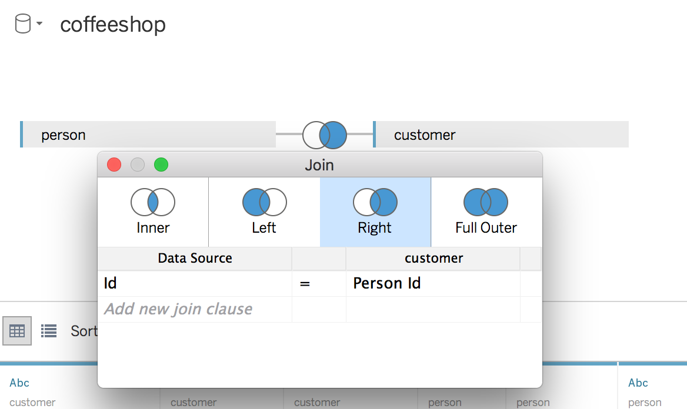

# Using Tableau

## Prerequisite

1. Please download and install the trial version of [Tableau](https://www.tableau.com/products/desktop/download)

## Lab

1. Open Tableau and Create a new Workbook. Select `Connect to data`

1. In the search window type `Postgres` and select the Postgres DB

1. In the popup input the configuration information for either your local postgres instance or your RDS instance.

1. Once you click sign in you should see something like the following if everything worked.

1. Find these tables then drag and drop them to the top right section of Tableau.
    1. The first table is Main.Person
    
    2. Next drag `Main.Customer`, click the join and select right. The blue ball on the right should be completely colored.
    
    2. Drag `Main.Transaction` and make it a right join
    3. Drag `Main.Transaction_Product` and make it an Inner Join
    4. Drag `Main.Product` and make it an Inner Join
1. Select Sheet 1
1. In the left menu find Main.Transaction.Id and drag it into the columns area at the top.

1. Create a calculated field for amount
    1. Right click on the measures area and select `Create Calculated Field`
    
    2. Name the calculated field `Amount`
    3. Find and drag Main.Transaction_Product.Quantity into the main area
    4. Multiply that by Main.Product.Current Item Price
    
    5. Click OK
1. Drag the `Amount` field to the rows area of Tableau. Notice it imediately draws a Bar graph

1. **Task**: Try playing around for a bit with the different types of Graphs. Can you make a pie graph that shows the percentage of revenue for each product sold?
