# Creating a RDS Instance #

## Introduction ##

AWS(Amazon Web Services) are a set of services otherwise known as a IaaS or [PaaS (Platform as a service)](https://en.wikipedia.org/wiki/Platform_as_a_service). These are designed to provide infrastructure, without needing a huge IT staff. The idea is to come up with common models and provide a hosted scalable solution to fill those models. This lab will work to teach you how to take advantage of one of these services called [RDS or Relational Data Service](https://aws.amazon.com/rds/). This service provides a cloud-based SQL database, and even better it provides most major databases flavors. Even older versions of certain databases to help with compatibility issues.

## Create an RDS Instance ##

1. Ensure you have already set up an AWS account through CSCC (see prereqs).
1. Log into [AWS](https://aws.amazon.com) using the credentials from the previous step.
    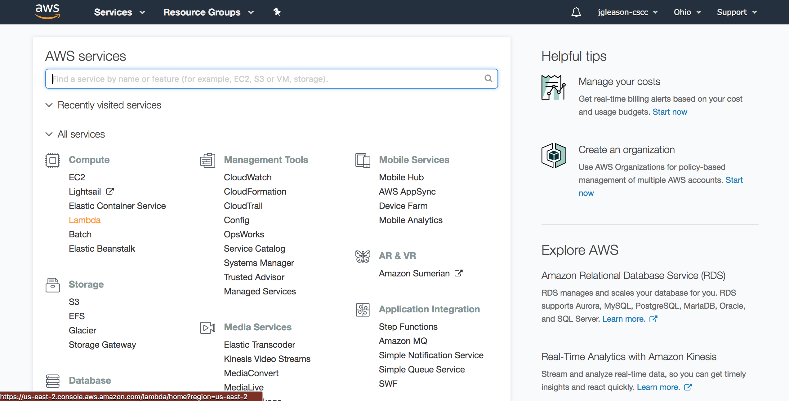
    1. This is what we call the root account. Much like most operating systems you should never use the root account in real life situations. However, it is fairly simple to use as a learning tool and AWS security is only covered in the additional reading. For now we will use the root account for the AWS server while editing.
1. Scroll down the page and select RDS from the services menu.
    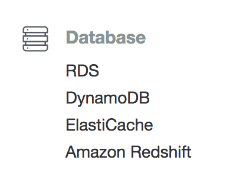
1. Select the Launch Instance button.
    
1. On the create instance page select RDS.
    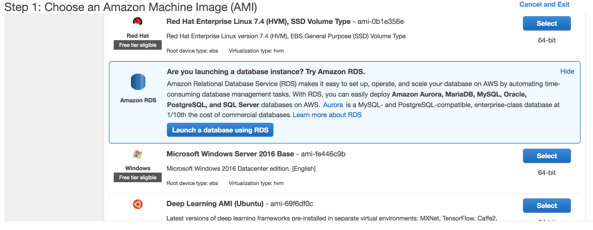
1. Since for this course we are using PostGRES select that database. However, notice that there are many other databases to choose from including MySQL, SQLServer, and even Amazon's own Aurora. 
    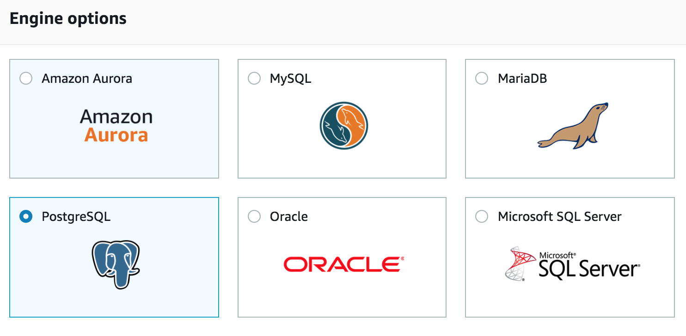
1. The next page provides a variety of options, to start with make sure you select dev/test to avoid additional charges.
    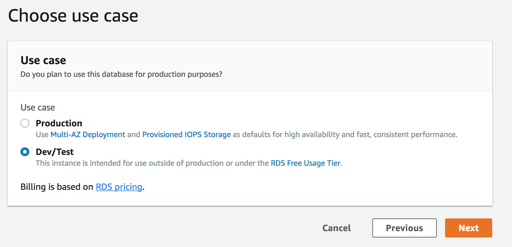
1. Make sure that the micro instance type is selected. This will prevent from you accidently creating costly instances.
    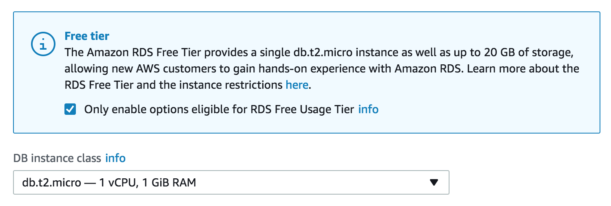
1. There are a few other settings that need to be set before we can create an RDS instance.
    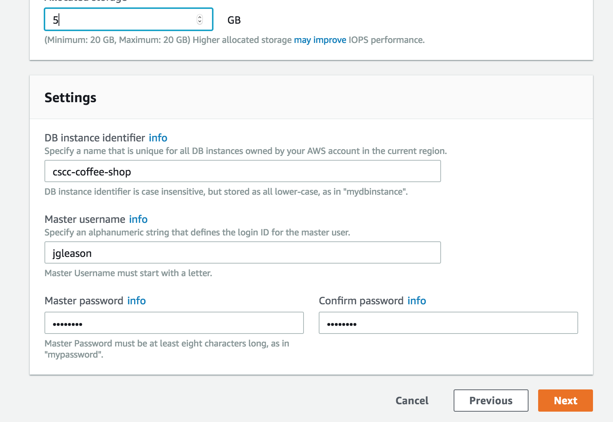]
    2. Be careful! Since we are using the free instances we are limited to 20GBs of space. AWS warns you about this, but please don't try anything fancy.
        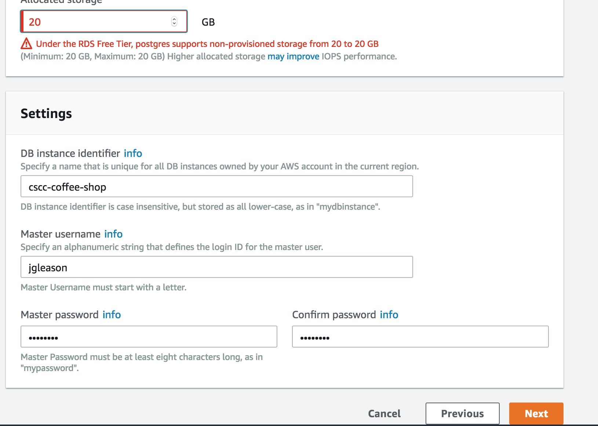  
    2. Make sure to take note of the *database name*, *main username*, and *password*  
10. Finally we need to configure our VPC settings. A VPC is essentially the same as using a subnet. It allows you to isolate your network environment from others. We will also create a security group, this will provide a policy to connect to the database.
    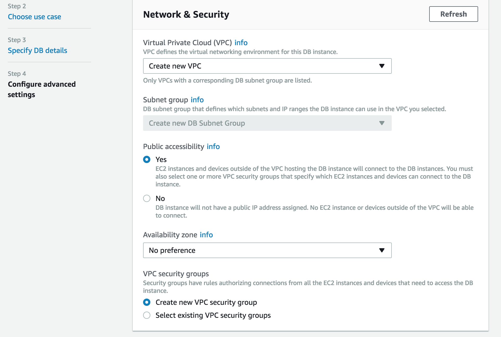
11. Select Finish
    1. You should be able to see the newly created VPC in the VPC list
    
    

## Allow for connections from anywhere ##

1. By default AWS only allows access from 1 IP. What if you happen to be in the coffee shop or school and want to access RDS? To accomplish this we will be opening our RDS instance to public traffic.
1. Search for and select VPC in AWS.
    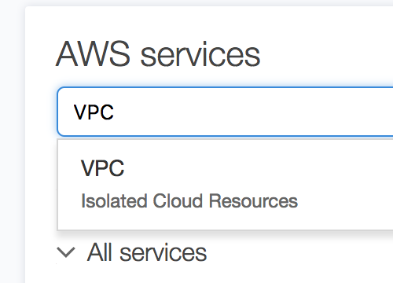
1. In the left hand menu, scroll down and select security group.
    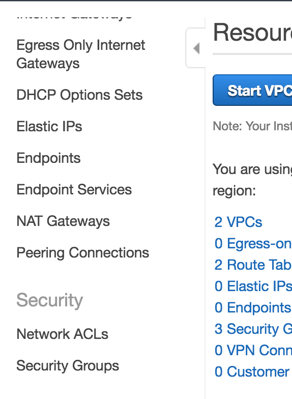
1. Select the security group for your RDS instance (look for the port in the inbound rules).
    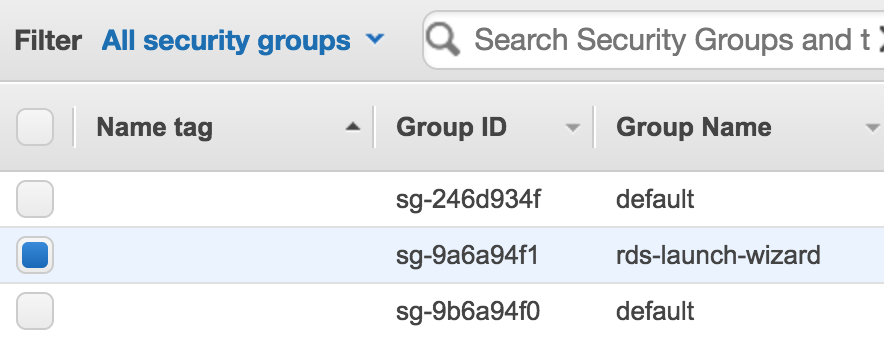
1. Select inbound rules on the bottom of the page.
1. Edit the rule and change it to match the following values.
    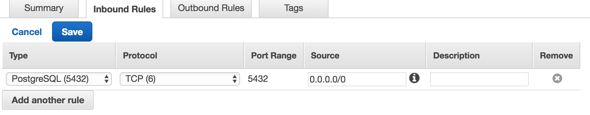

## Connect Via PSQL ##

1. Go to your AWS Management Console and Search for RDS

    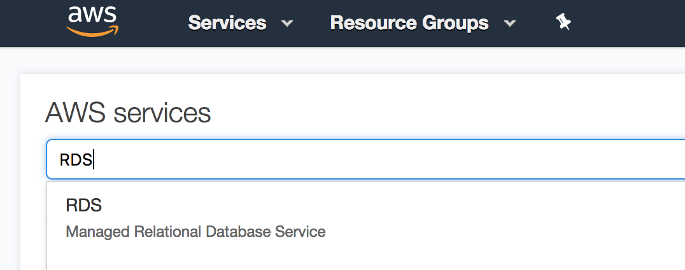

2. On the main page select DB Instances

    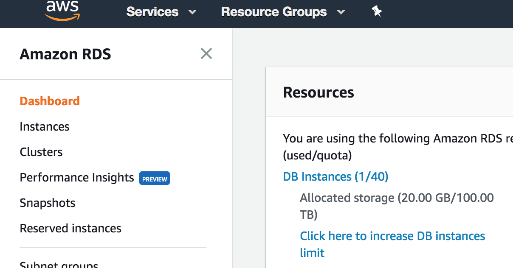

3. Select then instance in question

    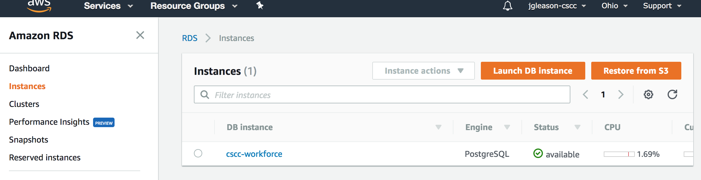

4. Scroll down and find the Endpoint. This is the *public url* for the server, also make note of the *port* (should be 5432)

    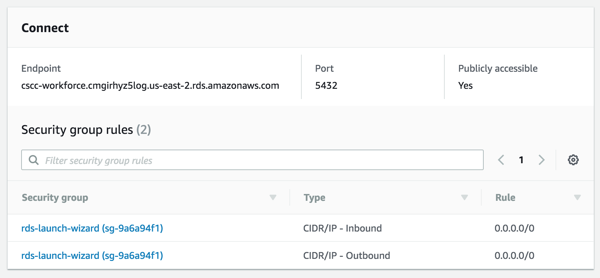

5. Use PSQL to connect to the RDS db  created in the last lab
    1. Use the following command `psql -h <public address> -p <port> -U <username> <database_name>`. In my case this looked like this `psql -h cscc-workforce.cmgirhyz5log.us-east-2.rds.amazonaws.com -p 5432 -U jgleason coffeeshop`

6. You should finally see the SQL prompt

    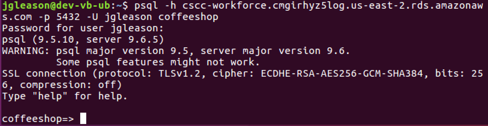

## Takehome Work

1. Add another user to the database and login using that user

