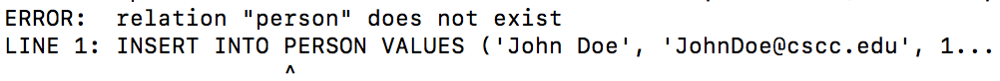

# Table Constraints #
## Introduction ##

In this lab we will create a few tables and create *constraints*. These constraints do things like prevent duplication, makes sure values in all the tables are updated appropriately and more.

## Lab ##

1. Reset the database using the following command from the root of the project.

        psql -h <AWS_URL> -p <PORT> -U <USER_NAME> <DB_NAME> -a -f ./labs/resources/sql/resetdb.sql

1. Connect to [the RDS instance and coffeeshop db](./creating_rds_instance.md#connect-psql).
1. We would like to track people and provide them with the ability to become a customer which provides incentives such as discounts. To do this we start by creating a `Person` and `Customer` table with the following SQL(#tables-v1).

        CREATE TABLE MAIN.CUSTOMER(
            ID SERIAL PRIMARY KEY,
            DISCOUNT INT
        );
        CREATE TABLE MAIN.PERSON(
          NAME VARCHAR(20) NOT NULL,
          EMAIL VARCHAR(20) NOT NULL,
          CUSTOMER_ID INT REFERENCES MAIN.CUSTOMER(ID)
          ON UPDATE CASCADE
          ON DELETE CASCADE,
          CONSTRAINT USER_KEY PRIMARY KEY (NAME, EMAIL)
        );

1. We now have a relationship between the Customer relation and the Person relation. To demonstrate what this means let's try to add a user without a character. To do this run the following...

        INSERT INTO PERSON VALUES ('John Doe', 'JohnDoe@cscc.edu', 1);

    Notice the error, this is because there is no customer with the ID of 1.

    

1. To resolve this issue we need to add an Customer **before** adding the Person. To do this use the following SQL...

        INSERT INTO MAIN.CUSTOMER (DISCOUNT) VALUES (0);

    You should see the following...

    > INSERT 0 1

    1. Notice we are including the `(DISCOUNT)`, this is because the ID column is generated. So if we are leaving a property undefined we need to declare which properties we are actually setting, in this case that is just *DISCOUNT*. If we were to set both we could alternatively use `INSERT INTO CUSTOMER VALUES (101, 0);` when we want the ID to be *101*.

1. Run `SELECT * FROM CUSTOMER;` and take not of the ID field.    
1. Now let's try that User insert again. To do this type the following in the terminal again...

        INSERT INTO MAIN.PERSON VALUES ('John Dow', 'jd@gmail.com', <ID Value>);

    Notice this time everything completes and you see the following.
    > INSERT 0 1

1. Now let's query the PERSON table and see what we have, paste the following select query...

        SELECT * FROM MAIN.PERSON;

    Notice the item

           name   |      email       | customer_id 
        ----------+------------------+-------------
         John Doe | JohnDoe@cscc.edu |           1
        (1 row)

9. Now let's see what **ON UPDATE CASCADE** means, let's say our user wants to change his character's name. To do this we would use the following query...

        UPDATE MAIN.CUSTOMER
        SET ID=420
        WHERE ID = <ID Value>;

    You should see the following...

    > UPDATE 1

10.  Now notice we haven't updated `PERSON` at all but when we run

        SELECT * FROM MAIN.PERSON;

    We see the new name...

           name   |      email       | customer_id 
        ----------+------------------+-------------
         John Doe | JohnDoe@cscc.edu |         420
         (1 row)

    This is because the change was cascaded to the other table thanks to our constraint.

11.  Now let's explore the delete cascade. Our user has decided this game wasn't for him and deleted his Character. Notice when he deletes the Character with the following query...

        DELETE FROM CUSTOMER WHERE ID=420;

    You should see the following...
    
    >DELETE 1

12. Now when we search the `PERSON` relation again we should notice that there are no longer any users...

        SELECT * FROM PERSON;

    Should return...

         first_name | last_name | char_name 
        ------------+-----------+-----------
        (0 rows)

## Takehome Work

1. Create schema for tables to track a user's transactions and also their favorite items.

## References ##
1. [Primary Key](https://w3resource.com/PostgreSQL/primary-key-constraint.php)
2. [Foriegn Key](https://www.postgresql.org/docs/8.3/static/tutorial-fk.html)
