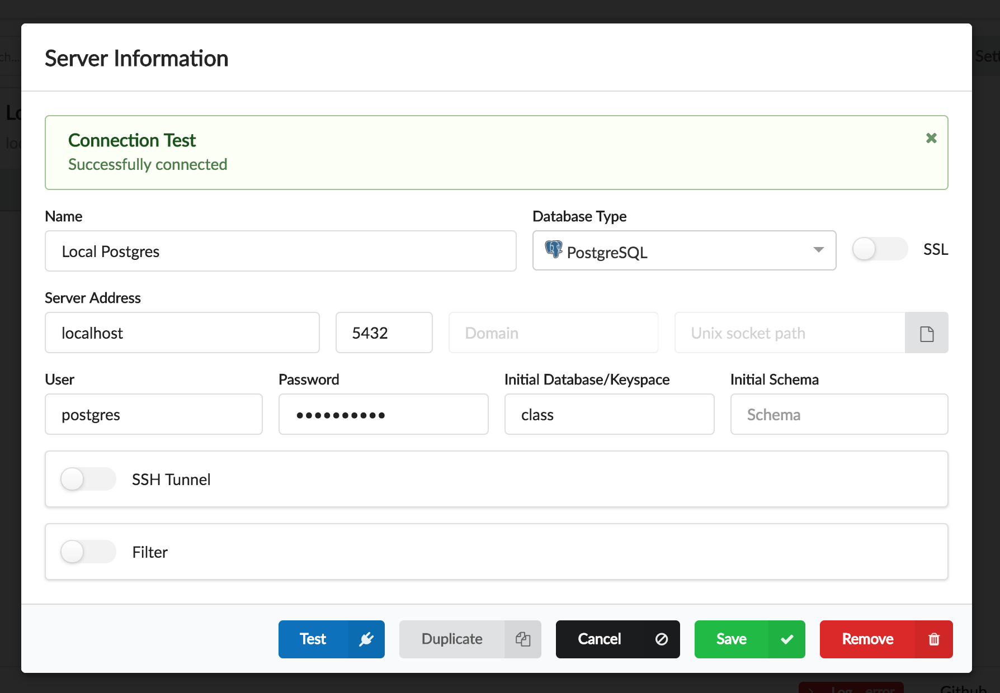

# Lab 2: Connect to PostGres via Gui #

1. Download and install [Sqlectron](https://sqlectron.github.io/).
2. Open the Sqlectron application.
3. Select the add button at the top of the application.
1. In the form inside the modal enter the following values.
    2. Name: Local PostGres
    2. Type: PostGres
    2. Server Address: localhost
    2. User: postgres
    2. Password: [See Lab 1](./creating_local_instance.md#password)
    2. Database: class

5. Push the test button and confirm the configuration is correct.

    

6. Select the save button.
7. At the servers screen select Local Postgres then select connect.
8. Notice we can connect to the database and we are given a screen that lets us run SQL against the server.

## Review ##

This lab was meant to install and familiarize 
