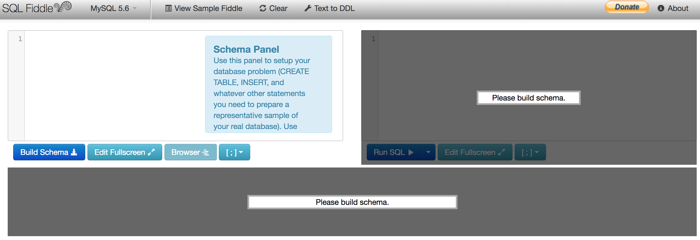
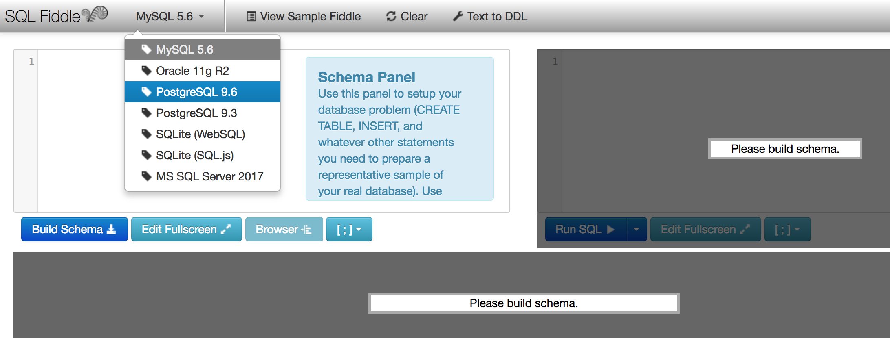
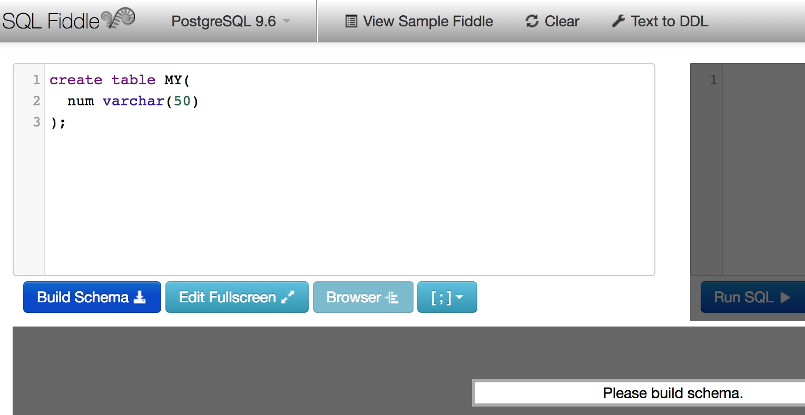
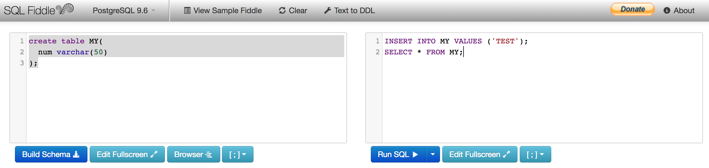
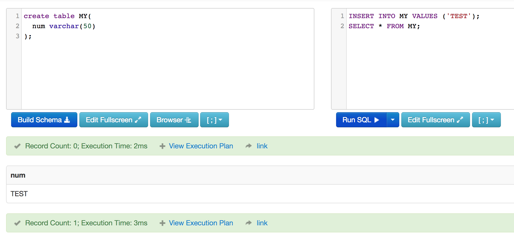

# Using SQLFiddle

## Introduction

SQL Fiddle is a tool that allows for easily testing SQL. This tool is great for quick proof of concepts. 

## Lab

1. Go to [SQL Fiddle](http://sqlfiddle.com/)
1. The site should look like this picture

    

1. The first important item is the dropdown that lets you select your SQL flavor. Since in this class we are using Postgres, select Postgres from the dropdown. 

    

1. In the `Schema` window we will add the code to create a table.

        create table MY(
            num varchar(50)  
        );

    

1. Click the build schema button, notice you can now edit the other text box.
1. This other text box is where we will put the SQL for inserting and selecting the data.

        INSERT INTO MY VALUES ('TEST');
        SELECT * FROM MY;

    

1. Click the Run SQL button and you should see it add and select the data.

    

